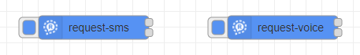
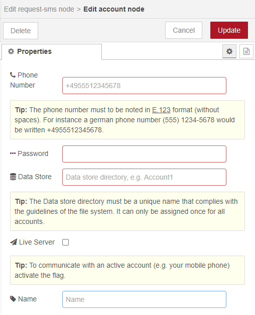
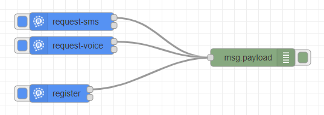
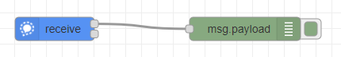
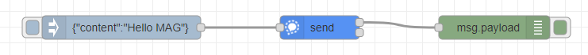
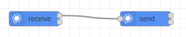
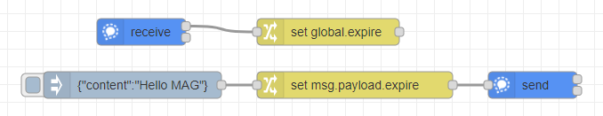

# nodered-contrib-signal-client
[Signal](https://signal.org) communicator client nodes to use the more secure messenger in Node-RED.

This is a third-party effort, and is NOT a part of the official [Signal](https://signal.org) project or any other project of [Open Whisper Systems](https://whispersystems.org).

# Installation
[](https://nodei.co/npm/nodered-contrib-signal-client/)

You can install the nodes using node-red's "Manage palette" in the side bar.

Or run the following command in the root directory of your Node-RED installation

    npm install nodered-contrib-signal-client --save

# Dependencies
The nodes are tested with `Node.js v14.15.3` and `Node-RED v1.2.6` on Windows and Raspberry Pi OS.
 - [@gausma/libsignal-service-javascript](https://github.com/gausma/nodered-contrib-signal-client)
 - [node-localstorage](https://github.com/lmaccherone/node-localstorage)
 - [bytebuffer](https://github.com/protobufjs/bytebuffer.js)
 
# Changelog
Changes can be followed [here](/CHANGELOG.md).

# Usage
## Registration
A Registration is required so that you can communicate via Signal. Registering an account takes place in two phases:

### Request a registration code
First, you'll request a registration code from the Signal server that you are authorized to use this number. The registration code can be queried through special nodes: request-sms or request-voice



The configuration of a Signal Communicator registration takes place in an account. An Account is tied to a phone number. When experimenting you probably want to get a temporary phone number via an online service like Google Voice rather than clobbering the keys for your own phone.

The password is an arbitrary string used for authentication against the Signal API. It will be registered with the Signal servers as part of the registration process.

The registration data determined are saved in the Node-RED settings. A directory is created within your Node-RED settings. The directory must be unique across all accounts. You can find the directory in "$HOME/.node-red" (Linux: /home/USER/.node-red/signal,  Windows: C:\Users\USER\.node-red\signal).

Live Server: For safety, a Signal staging server (testing server) can be used  while you carry out your experiments. This means that it will only send and receive messages from other clients using the staging server! 



### Interface
| I/O      | Execution          | Message Properties | Type   | Description     |
| :------- | :----------------- | :----------------- | :----- | :-------------- |
| Input    | Injection button   | -                  | -      | -               |
| Output_1 | Successful request | payload            | string | Success message |
| Output_2 | Error on request   | payload            | string | Failure message |

### Confirm the registration code
You'll receive an SMS message or a voice call with an registration code at the number your specified. Use the code to register your account with the Signal service:


Select the account for which the registration code was requested. Enter the registration code as received (format: "nnn-nnn" or "nnnnnn")


__Don't forget to "Deploy" after configure the single nodes!__

__A "Deploy" or Node-RED restart is also necessary if the account for a receiver node is changed - especially after registration. This will restart all receive nodes with the actual configuration.__

__Success messages are not displayed in the "Debug messages" sidebar. You can connect a debug node to output 1 for this. 
This is not necessary for error messages. These are always output in the sidebar and in the log.__

### Interface
| I/O      | Execution          | Message Properties | Type   | Description     |
| :------- | :----------------- | :----------------- | :----- | :-------------- |
| Input    | Injection button   | -                  | -      | -               |
| Output_1 | Successful request | payload            | string | Success message |
| Output_2 | Error on request   | payload            | string | Failure message |

## Sending a message
The "send" node is used to send a message.


A previously registered account is selected as sender.

The recipient's phone number can be configured to receive the message. Optionally, it can be passed in the message. If the number is in the message, it will be used (instead of the configured one). Output 1 forwards the sent message. The recipient number actually used is entered in this message.

The "Verbose Logging" checkbox is activated for extended log outputs in the Node-RED log. The logs are not shown in the "Debug messages" sidebar.


A text (payload.content) and one or more attachments in the form of files can be sent simultaneously in a message. To send files, the paths and file names are entered in the payload.attachments array. The paths are specified in absolute or relative terms (based on the user directory). You can find the directory in "$HOME/.node-red" (Linux: /home/USER/.node-red/signal,  Windows: C:\Users\USER\.node-red\signal). The files can be of any type. If they are sent to a receive node, they can be stored 1:1. A Signal messegner (e.g. on the cell phone) interprets the files, if known. Otherwise he offers them for download.

Use disappearing messages to keep your message history tidy in your Signal communicator. The message will disappear from your devices after the timer has elapsed. Disappearing messages can be managed by anyone in the chat. Use the payload.expire property to the "send" node to configure the settings for that chat. The setting applies to any new message after the timer has been set or modified for all paticipants.

A simple flow can look like this:


### Interface
| I/O      | Execution       | Message Properties     | Type   | Optional | Description                                |
| :------- | :-------------- | :--------------------- | :----- | :------- | :----------------------------------------- |
| Input    | Send message    | payload.receiverNumber | string | yes      | The receiver's phone number                |
|          |                 | payload.content        | string | no       | Message to send                            |
|          |                 | payload.attachments    | array  | yes      | Array of file paths (absolute or relative) |
|          |                 | payload.expire         | number | yes      | Expire timeout                             |
| Output_1 | Successful sent | payload.receiverNumber | string | no       | Used receiver's phone number, either from the message or configured |
|          |                 | payload.senderNumber   | string | no       | The sender's phone number                  |
|          |                 | payload.content        | string | no       | Sent message                               |
|          |                 | payload.attachments    | array  | yes      | Array of used file paths                   |
|          |                 | payload.expire         | number | yes      | Expire timeout                             |
| Output_2 | Error on sent   | payload                | object | no       | Failure message object                     |

## Reveiving a message
The "receive" node is used to receive a message.


A previously registered account is selected as receiver.

Attachments are savend in the download directory. The donwload directory is specified in absolute or relative terms (based on the user directory). You can find the directory in "$HOME/.node-red" (Linux: /home/USER/.node-red/signal,  Windows: C:\Users\USER\.node-red\signal). If no download directory is specified, the attachments are copied to the root of the user directory.

The "Verbose Logging" checkbox is activated for extended log outputs in the Node-RED log. The logs are not  shown in the "Debug messages" sidebar.


The received message is contained in the payload of the output.

The attachments are saved in the download directory. One or more attachments can be received at the same time. They are saved with the filename and the extension of the sender. Attachments from a Signal messegner (e.g. on the cell phone) can have a cryptic name if they were created temporarily.

If the setting for disappearing messages has been changed in the chat, a message will be sent. The new timer value (payload.expire) is shown in the output of the "receive" node. So that the timeout set by the client does not change, you can save it temporarily and transfer it with the next send (see exmaple 5).

A simple flow can look like this:


__To avoid problems ensure that you connect maximal one receiver node to one account.__

### Interface
| I/O      | Execution          | Message Properties     | Type   | Optional | Description                                    |
| :------- | :----------------- | :--------------------- | :----- | :------- | :--------------------------------------------- |
| Input    | -                  | -                      | -      | -        | -                                              |
| Output_1 | Successful receive | payload.content        | string | no       | Received message content                       |
|          |                    | payload.senderNumber   | string | no       | The sender's phone number                      |
|          |                    | payload.senderUuid     | string | no       | The sender's unique identification             |
|          |                    | payload.receiverNumber | string | no       | The receiver's phone number                    |
|          |                    | payload.attachments    | array  | yes      | Array of the received file paths               |
|          |                    | payload.expire         | number | yes      | Expire timeout, set by the sender (in seconds) |
|          |                    | originalMessage        | string | no       | Original received object from the underlying library [@gausma/libsignal-service-javascript](https://github.com/gausma/nodered-contrib-signal-client) |
| Output_2 | Error on receive   | payload                | object | -        | Failure message object                         |

# Examples

---

Remark: All example flows can be found in the examples folder of this package. In Node-RED they can be imported via the import function (hambuger menu). Select the examples directly from the "Examples" vertical tab menue.

---

## 1 Registration flow
The registration code is requested either by the request-sms node or the request-voice node. The transmitted registration code is entered in the register node and the registration is carried out.

To display the success message you can connect a debug message to output 1. This is not necessary for error messages. These are always output in the sidebar and in the log.



Example: 01_registration

## 2 Simple receive
Use a Receive node to receive a message from your friend. A message that is sent to the configured account is displayed as a debug message. The telephone number and the id of the seder are also logged.



Example: 02_simple-receive

## 3 Simple send
You can send a message to your friend with the send node. In the example, the message is created by an inject node and thus the send node is triggered. The message is output in the debug node as confirmation.



Example: 03_simple-send

This example can easily be extended to send attachments. The payload is written as follows:
```
{
    "receiverNumber": "+4955512345678",
    "content": "Hello MAG",
    "attachments": [
        "example/image.png",
        "example/music.mp3"
    ]
}
```

Note: On Windows systems, a double backslash must be used in strings when noting a path (e.g. "example\\image.png")

## 4 Simple echo
A simple flow: the received message is returned to the sender. This flow represents the basis for a command flow and can be expanded accordingly. 

It must be ensured that the sender number is assigned to the recipient number so that the message can be returned to the sender. Content of the function node:
```
msg.payload.receiverNumber = msg.payload.senderNumber;
delete msg.payload.senderNumber;
return msg;
```



Example: 04_simple-echo

## 5 Expire timeout

So that the timeout for disappearing messages set by the client does not change, you can save it to a global variable and transfer it with the next send.



Example: 05_expire_timeout


# License
[](http://www.gnu.org/licenses/gpl-3.0.html)

nodered-contrib-signal-client is a free software project licensed under the GNU General Public License v3.0 (GPLv3) by Martin Gaus.
