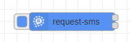
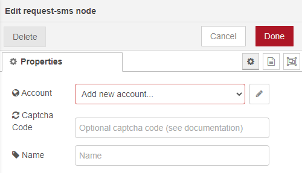
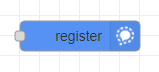
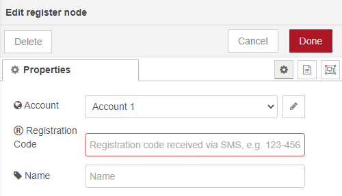
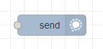
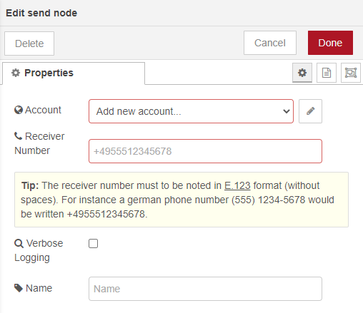
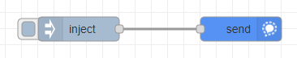
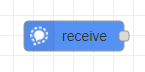
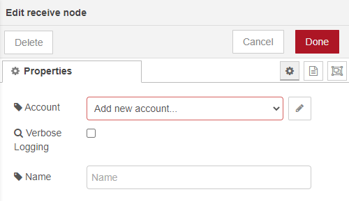
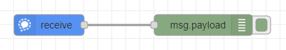

# nodered-contrib-signal-client
[Signal](https://signal.org) communicator client nodes for Node-RED

This is a third-party effort, and is NOT a part of the official [Signal](https://signal.org) project or any other project of [Open Whisper Systems](https://whispersystems.org).

# Installation

You can install the nodes using node-red's "Manage palette" in the side bar.

Or run the following command in the root directory of your Node-RED installation

    npm install nodered-contrib-signal-client --save

# Dependencies
The nodes are tested with `Node.js v14.15.3` and `Node-RED v1.2.6`.
 - [@gausma/libsignal-service-javascript](https://github.com/gausma/nodered-contrib-signal-client)
 - [node-localstorage](https://github.com/lmaccherone/node-localstorage)
 - [bytebuffer](https://github.com/protobufjs/bytebuffer.js)

 # Changelog
Changes can be followed [here](/CHANGELOG.md).

# Usage
## Registration
A Registration is required so that you can communicate via Signal. Registering an account takes place in two phases:

### Request a registration code
First, you'll request a registration code from the Signal server that you are authorized to use this number. The registration code can be queried through a special node: request-sms

A Signal Communicator Account is tied to a phone number. When experimenting you probably want to get a temporary phone number via an online service like Google Voice or Twilio rather than clobbering the keys for your own phone.

The password is an arbitrary string used for authentication against the Signal API, it will be registered with the Signal servers as part of the registration process.

The registration data determined are saved in the Node-RED settings. A directory is created within your Node-RED settings. The directory must be unique across all accounts. You can find the directory in "$HOME/.node-red" (Linux: /home/USER/.node-red,  Windows: C:\Users\USER\.node-red)

Live Server: For safety, a Signal staging server (testing server) can be used  while you carry out your experiments. This means that it will only send and receive messages from other clients using the staging server! 

### Confirm the registration code
You'll receive an SMS message with an registration code at the number your specified. Use the code to register your account with the Signal service:

Select the account for which the registration code was requested. Enter the registration code as received (format: nnn-nnn)

Both nodes can be executed by a simple "inject" node.

<b>Don't forget to "Deploy" after configure the single nodes!</b>

<b>After the registration is complete, the Node-RED server must be restarted. Otherweise the registration is not effective for the send and receive nodes!</b>

## Sending a message
The "send" node is used to send a message.

A previously registered account is selected as sender. The recipient's telephone number is configured for receiving the message.

The message to be sent is transferred in the payload as string when the node is executed. A simple flow can look like this:

## Reveiving a message
The "receive" node is used to receive a message.

A previously registered account is selected as receiver.

The received message is contained in the payload of the output. A simple flow can look like this:

# License

nodered-contrib-signal-client is a free software project licensed under the GNU General Public License v3.0 (GPLv3) by Martin Gaus.
